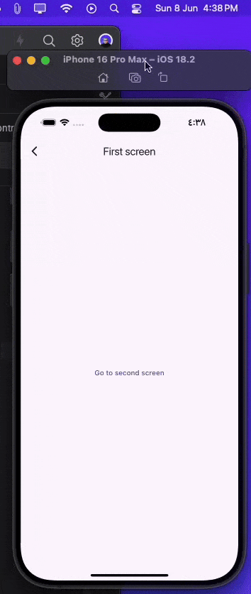

[](https://thebsd.github.io/StandWithPalestine)

# Internet State Manager 🌐

[](https://pub.dev/packages/internet_state_manager)
[](LICENSE)

A powerful Flutter package for seamless internet connection management. **Not just another connectivity checker** — it's a complete solution that handles, monitors, and manages internet states across your entire app with minimal code! 🚀

## ✨ Why Internet State Manager?

| Feature | Description |
|---------|-------------|
| 🎯 **Accurate Detection** | Goes beyond Wi-Fi checks — verifies actual internet access |
| 🔄 **Auto Recovery** | Automatically restores app state when connection returns |
| 🎨 **Customizable UI** | Built-in widgets + full customization support |
| ⚡ **Minimal Code** | Wrap once, manage everywhere |
| 📡 **Real-time Updates** | Stream-based connectivity monitoring |

---

## 📋 Requirements

| Platform | Minimum Version |
|----------|-----------------|
| Flutter | ≥ 3.19.0 |
| Dart | ≥ 3.3.0 \<4.0.0 |
| iOS | ≥ 12.0 |
| macOS | ≥ 10.14 |
| Java | 17 |
| Android Gradle Plugin | ≥ 8.12.1 |
| Gradle Wrapper | ≥ 8.13 |

---

## 🚀 Getting Started

<details open>
<summary><b>Installation</b></summary>

Add to your `pubspec.yaml`:

```yaml
dependencies:
  internet_state_manager: ^1.9.0
```

Then run:

```bash
flutter pub get
```

</details>

<details open>
<summary><b>Platform Configuration</b></summary>

### Android

Add these permissions to `android/app/src/main/AndroidManifest.xml`:

```xml
<manifest xmlns:android="http://schemas.android.com/apk/res/android">
    
    <!-- Required for internet_state_manager -->
    <uses-permission android:name="android.permission.INTERNET"/>
    <uses-permission android:name="android.permission.ACCESS_NETWORK_STATE"/>
    
    <application ...>
```

### iOS

Add to `ios/Runner/Info.plist`:

```xml
<key>NSLocalNetworkUsageDescription</key>
<string>This app requires access to the local network to monitor connectivity status.</string>
```

</details>

---

## 📖 Usage

<details open>
<summary><b>1. Initialize the Package</b></summary>

Wrap your app with `InternetStateManagerInitializer`:

```dart
void main() async {
  WidgetsFlutterBinding.ensureInitialized();
  
  // ⚠️ REQUIRED: Initialize before runApp
  await InternetStateManagerInitializer.initialize();

  runApp(
    InternetStateManagerInitializer(
      options: InternetStateOptions(
        checkConnectionPeriodic: const Duration(seconds: 3),
        showLogs: true,
      ),
      child: const MyApp(),
    ),
  );
}
```

</details>

<details open>
<summary><b>2. Wrap Your Screens</b></summary>

Simply wrap any screen with `InternetStateManager`:

```dart
@override
Widget build(BuildContext context) {
  return InternetStateManager(
    child: Scaffold(
      body: Center(
        child: Text('Your content here'),
      ),
    ),
  );
}
```

<!-- TODO: Add screenshot/GIF here -->
<!--  -->

</details>

---

## 🎨 Customization

<details>
<summary><b>Builder Widget</b></summary>

Full control over your UI based on connection state:

```dart
InternetStateManager.builder(
  builder: (context, state) {
    return Scaffold(
      body: Center(
        child: state.status.isConnected
            ? Text('✅ Connected!')
            : Text('❌ No internet'),
      ),
    );
  },
);
```

</details>

<details>
<summary><b>Connection Restoration Callback</b></summary>

Execute logic when connection is restored:

```dart
InternetStateManager(
  onRestoreInternetConnection: () {
    // Refresh data, sync, etc.
    setState(() {
      fetchData();
    });
  },
  child: MyScreen(),
);
```

</details>

<details>
<summary><b>Custom No-Internet Screen</b></summary>

Replace the default disconnected UI:

```dart
InternetStateManager(
  noInternetScreen: CustomNoInternetWidget(),
  child: MyScreen(),
);
```

</details>

<details>
<summary><b>Options Configuration</b></summary>

```dart
InternetStateOptions(
  // Check interval when connected
  checkConnectionPeriodic: const Duration(seconds: 12),
  
  // Check interval when disconnected (faster retry)
  disconnectionCheckPeriodic: const Duration(seconds: 3),
  
  // Custom colors
  errorBackgroundColor: Colors.red,
  onBackgroundColor: Colors.white,
  
  // Custom labels
  labels: InternetStateLabels(
    noInternetTitle: () => 'Oops! No Connection',
    descriptionText: () => 'Please check your network',
    tryAgainText: () => 'Retry',
  ),
  
  // Debug logs
  showLogs: true,
)
```

</details>

---

## 🛠️ Advanced Usage

<details>
<summary><b>Context Extensions</b></summary>

Access connection state from anywhere:

```dart
// Check current state
bool isConnected = context.internetState.isConnected;

// Manual connection check
await context.internetCheck();

// Listen to connection stream
context.internetStateStream.listen((state) {
  print('Connection changed: ${state.isConnected}');
});
```

</details>

<details>
<summary><b>Global App Integration</b></summary>

Apply to your entire app:

```dart
class MyApp extends StatelessWidget {
  @override
  Widget build(BuildContext context) {
    return MaterialApp(
      builder: (context, child) => InternetStateManager(child: child!),
      home: HomeScreen(),
    );
  }
}
```

</details>

---

## 📱 Screenshots

<!-- TODO: Add screenshots/GIFs -->
<!--
| Connected | Disconnected | Restoring |
|:---------:|:------------:|:---------:|
|  |  |  |
-->

---

## 🙏 Credits

Developed by [Mostafa Alazhariy](https://github.com/MAlazhariy)

**Dependencies:**
- [connectivity_plus](https://pub.dev/packages/connectivity_plus) — Fast local network detection
- [internet_connection_checker_plus](https://pub.dev/packages/internet_connection_checker_plus) — Actual internet verification

---

## 👥 Contributors

[](https://github.com/MAlazhariy/internet_state_manager/graphs/contributors)

---

## ⭐ Support

If you find this package helpful, please give it a star on [GitHub](https://github.com/MAlazhariy/internet_state_manager)! 

Feel free to [open issues](https://github.com/MAlazhariy/internet_state_manager/issues) or submit PRs.
